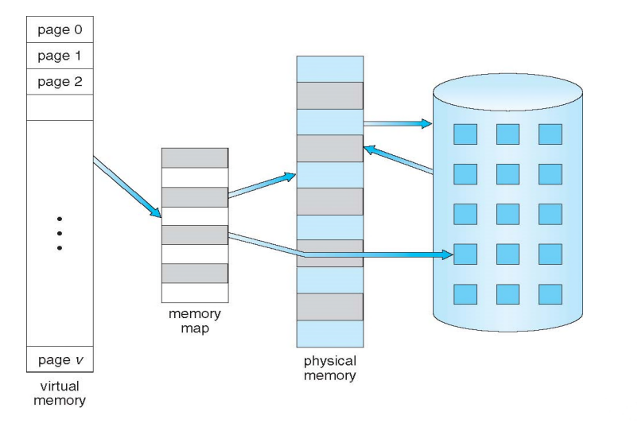
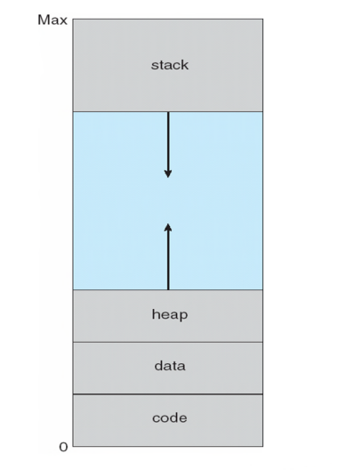
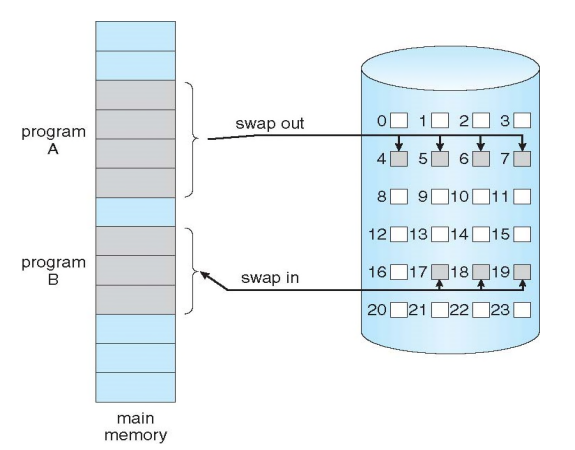
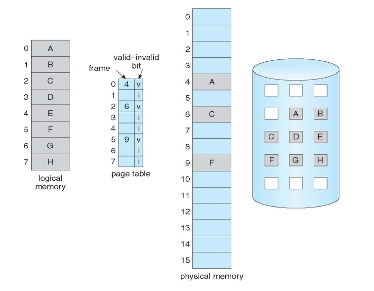
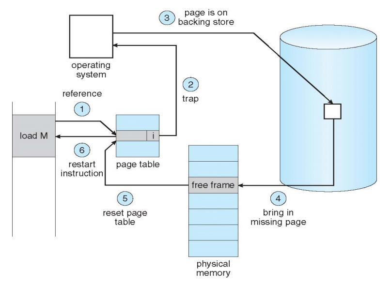

# Virtual Memory & Demand Paging

## Background

이전까지는 전체 코드가 메모리 상에 올라가야 코드 실행 but 실질적으로 프로그램이 실행될 때, 코드의 모든 부분을 수행하는 것은 아님. 

	- 1. 프로그램의 전체가 사용되는 것은 아니기 때문에(Error code, unusual routines, large data structure)
	- 2. 프로그램의 전체를 사용하더라도, 모든 프로그램이 동시에 사용되는 것은 아니기 때문이다.

### 가상 메모리가 적용되기 전의 상황

결론 : 초창기에는 **partially-loaded program**을 고안하였다.  partially loaded program이란 추후에 프로그램에서 필요한 부분이 있을 때,  추가적으로 그 부분을 메모리상에 올릴 수 있도록 해주는 기법.  다음과 같은 특징이 있다.

	- 물리적인 메모리의 한계에 구애받지 않는다. 
	- 실질적인 프로그램 메모리 요구량이 낮아지므로 더 많은 프로그램을 동시에 실행할 수 있다.

### Virtual Memory(가상 메모리)

#### 	정의 : Seperation of user logical memory from physical memory 

	- 가상의 메모리를 물리 메모리로부터 분리시키는 기술
	- 1957년에 개념 발표, 실제 적용은 1961년, 1965년에 멀틱스 시스템 이후 본격 채용

​	실질적으로 사용자 컴퓨터에 16기가의 메모리가 꽂혀 있다 하더라도, 모든 사용자가 가상 메모리를 적용한 운영체제를 사용하기만 한다면, 32기가의 프로그램을 	각 프로세스에게 할당할 수 있게끔 할 수 있다. 

 - 프로그램의 전체가 메모리상에 올라오지 않더라도 프로그램의 실행이 가능하기 떄문이다.

 - Logical address space가 physical address space보다 더욱 커지게 된다. - physical address space가 작더라도 훨씬 큰 메모리를 가지고 있는 것처럼 사용자에게 느끼게 할 수 있다.

 - 동시에 더 많은 프로그램을 실행할 수 있다. - 정말 실행에 필요한 필수 부분만 갖다 놓고 실행하는 테크닉

   

## Logical address vs Physical address

1. Logical address(virtual address - 가상 메모리 주소) 

   ​	CPU가 생성하는 주소, 세그먼트와 세그먼트 offset으로 구성되며**, MMU(Memory Management Unit)에 의해 physical address로 변환**됨

   ​	프로세스마다 독립적으로 가지는 주소공간 - 주소가 0부터 시작됨(나혼자 사용하기 때문에 순차적으로 적용)

   

2.  Physical address

   ​	물리 메모리에 실제로 올라가는 위치 

   ​	page frame들마다 physical memory가 구성된다.

## Physical Mapping

가장 왼쪽에 있는 박스는 가상 메모리(개별 프로그램에서 보는) 공간이다. 이 가상메모리의 데이터가 physical memory에 mapping되어야만 데이터로서 의미를 가질 수 있다. 이를 매핑시켜주는 특정 페이지가 바로 memory map이다. physical memory상의 특정 page가 memory map이며, virtual memory와 physical memory의 교두보 역할을 한다.

특정 페이지를 필요로 하는 시점에서 하드디스크에서 physical memory로 이동, memory map을 매개로 virtual memory에 page정보를 저장하며, 이 과정을 통해 프로그램을 실행할 수 있다. 따라서 프로그램의 전 영역을 실행 및 수행할 수 있는 것으로 간주할 수 있다. 실질적으로 physical memory상의 어떤 메모리가 올라와 있고, 어떤 메모리를 하드 디스크에서 가져올 지는 우리가 상관할 이유가 없다 : 운영체제의 역할이기 때문에!

## Virtual-address Space의 구조

0번지부터 code(program), data(전역변수, 정적변수 등), heap(상향방향-0번지부터 시작)과 stack(하향방향-max부터 시작)

heap 영역의 경우는 동적 할당 데이터를 다룰 때 사용

stack 영역의 경우는 지역변수, 또는 프로그램 수행에 필요한 여러가지 stack 등이 들어간다.

## Demand Paging (요구 페이징)

**개념 : page를 메모리로 가져오는데, 그 페이지를 요구했을때에만 메모리로 가져온다. Only when it is needed**

일단 수행하는데 필요한 필수적인 코드를 가져오고 나머지는 나중에 필요했을 때 가져오면 되기 때문에.

장점 : Less memory needed, Faster response, More users

Swapping 과 굉장히 비슷함. 차이점이라고 한다면 Swapping은 프로그램 전체에 대한 동작이고, Demanding은 개별 페이지에 대해서 필요한 경우에만 가져올 수 있도록 한다는 점에서 차이점이 있다.

# 가상메모리의 구현(Demand Paging의 구현)

#### 어디에? : MMU에 Demand paging을 구현하는 기능을 추가하면 된다. 

#### 기능

1. 접근하려고 하는 페이지가 이미 메모리에 올라와 있다면 demand-paging을 할 필요가 없다. 
2. 접근하려고 하는 페이지가 메모리에 존재하지 않는다면 Demand Paging Technique이 필요하다.  Storage로부터 페이지를 가져와서 메모리에 올린다. 

가상 메모리의 페이지 테이블 상에 valid/invalid bit를 할당하여  내가 찾고자하는 페이지가 원래 invalid한 page에 접근하려고 하는지 / valid하지만 demand paging technique이 걸려 있어서 아직 올라오지 않은 page인지 구분할 필요가 있다. 

##### valid(v) : 내가 찾고자 하는 내용이 이미 메모리 상에 올라와 있는 상태

##### invalid(v) 내가 찾고자 하는 내용이 일시적으로 메모리 상에 없는 상태(이 경우 원래는 physical memory에 있어야 하지만 가상메모리에는 존재)

MMU address translation 과정중에서, [i] bit에 대한 경우 **page fault**를 발생, 운영체제를 통해서 해당 page에 대해서 storage에서 가져온 후, v/i 값을 v로 변환.

## Page Fault

존재하지 않는 페이지를 요청했을 때 발생(예외상황)

1. 운영체제가 일시적으로 없는지, 혹은 원래 없는건지 판단한다.

    - memory에 단순히 없는 것이라면 Demand paging을 통해 해결

    - 원래 없는 페이지라면 abort, 불법적인 접근으로 판단한다.

      

2. Free Frame을 찾아야 한다.

   - 내가 가져와서 저장할 페이지를 어디에 저장할 것인지, 즉 physical memory 상의 Free한 공간을 먼저 확보하여야 한다.

     

3. 요청받은 페이지를 2번에서 찾은 Free Frame으로 swap시킨다. 이후 validation bit를 v로 변환시킨다.

4. Page Fault를 발생시킨 시점으로 회귀한다. 

