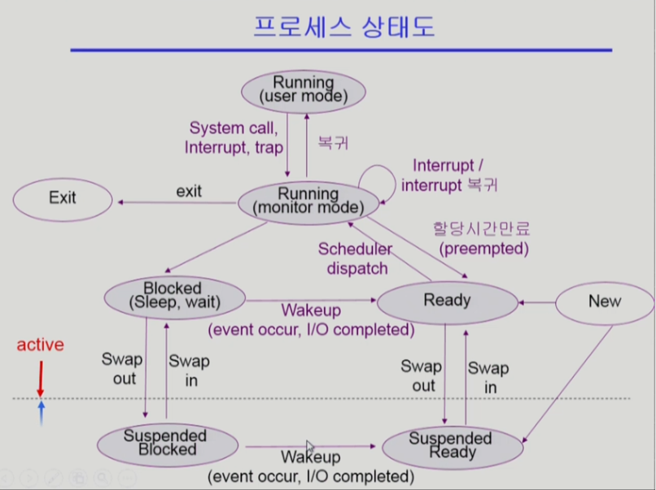

## [프로세스 #1](https://core.ewha.ac.kr/publicview/C0101020140318134023355997?vmode=f)

### 프로세스의 개념

- Process is a program in execution : 실행 중인 프로그램
  - 프로세스의 문맥(context)
    - 현재 상태를 규정: 어디를 가리키고 있는가? - 프로세스의 현재 상태를 규정하기 위한 모든 재료
      - 프로세스 A의 주소공간과 커널 주소공간 정보가 필요함
    - CPU 수행 상태를 나타내는 하드웨어 문맥
      - Program Counter
      - 각종 Register
    - 프로세스의 주소 공간
      - code, data, stack
      - Program Counter가 가리키는 공간
    - 프로세스 관련 커널 자료 구조
      - PCB(Process Control Block)
      - Kernel stack
- 프로세스는 계속해서 제어권이 넘어가기 때문에 현재 문맥을 잡아놓지 않는다면 오류발생
  - 프로세스의 문맥을 파악 후 다음 instruction을 실행할 수 있도록 하는 것

### 프로세스의  상태 (Process State)

- 프로세스는 상태가 변경되며 수행된다
  - Running : CPU를 잡고 instruction을 수행중인 상태
  - Ready :메모리를 포함한 다른 모든 조건을 만족 후 CPU를 실행하기 위해 기다리는 상태
  - Blocked(wait, sleep)
    - CPU를 주어도 당장 instruction을 실행할 수 없는 상태
    - Process가 I/O 작업 등이 필요하여 해당 작업이 완료되기 전까지 프로세스가 진행되지 않는 상태
  - New : 프로세스가 생성중인 상태
  - Terminated : 수행이 끝난 상태
  - Suspended(stopped)
    - 외부적인 이유로 프로세스의 수행이 정지된 상태
    - 프로세스는 통째로 디스크에 swap out된다
    - 중기 스케쥴러에 의해 막힌 프로세스의 상태를 표현

생성 - ready상태 - cpu를 얻게 되면 running상태로 됨 

1. IO event : wait상태로 변환 후 ready상태로 회귀
2. interrupt에 의한 할당 시간이 만료되는 경우
3. 작업이 끝나서 exit에 의해 terminated됨

### Process Control Block(PCB) 위치 : 커널 주소공간 내 data

- 운영체제가 각 프로세스를 관리하기 위해서 프로세스당 유지하는 정보
  - 다음의 구성 요소를 가진다(구조체로 유지됨)
    - OS가 관리상 사용하는 정보
      - Process state, Process ID
      - Scheduling information, priority
    - CPU 수행 관련 하드웨어 값
      - Program counter registers
    - 메모리 관련 정보
      - Code, data, stack이 메모리의 어디에 위치해 있는가
    - 그 외 파일 관련 정보들

### 문맥 교환 (Context Switch)

- CPU를 한 프로세스에서 다른 프로세스로 넘겨주는 과정

  - CPU가 다른 프로세스에게 넘어갈 때 운영체제는 다음을 수행한다
    - CPU를 내어주는 프로세스의 상태를 그 프로세스의 PCB에 저장하고
    - CPU를 새롭게 얻는 프로세스의 상태를 그 프로세스의 PCB에서 읽어온다.

- System call / Interrupt 발생시 반드시 context switch가 일어나는 것은 아니다

  - 사용자 프로세스로부터 CPU가 운영체제로 넘어가기 때문에 context switch가 아님

  

  - 프로세스 A실행 중 S/I 발생하여 운영체제로 CPU제어권이 넘어가고, 커널함수 실행 후 해당 프로세스 A로 다시 복귀(context switch아님)
  - 프로세스 A실행 중 timer interrupt or I/O를 요청하는 system call이 일어나는 경우, 커널함수 실행 후 문맥교환이 일어나서 다른 프로세스 B로 CPU가 넘어간다.
  - 전자의 경우에도 PCB에 상태가 저장되지만, 후자에 비해서는 굉장히 부담이 적다.

### 프로세스를 스케줄링하기 위한 큐

- Job Queue
  - 현재 시스템 내에 있는 모든 프로세스의 집합
- Ready queue
  - 현재 메모리 내에 있으면서 CPU를 잡아서 실행되기를 기다리는 프로세스의 집합
- Device queue
  - I/O device의 처리를 기다리는 프로세스의 집합
- 프로세스들은 각 큐들을 오가며 수행된다.

### 스케줄러 (Scheduler)

- Long-term scheduler(장기 스케쥴러 or job scheduler)
  - 시작 프로세스 중 어떤 것들을 ready queue로 보낼지 결정
  - 프로세스에 memory(및 각종 자원)을 주는 문제
  - degree of Multiprogramming을 제어
  - time sharing system에는 보통 장기 스케쥴러가 없음(무조건 ready)
- Short-term scheduler(단기 스케쥴러 or CPU scheduler)
  - 어떤 프로세스를 다음번에 running시킬지 결정
  - 프로세스에 CPU를 주는 문제
  - 충분히 빨라야 함(ms단위에서 실행)
- Medium-Term Scheduler(중기 스케쥴러 or Swapper)
  - 여유 공간 마련을 위해 프로세스를 통째로 메모리에서 디스크로 쫓아냄
  - 프로세스에게서 memory를 뺏는 문제
  - degree of Multiprogramming을 제어

## [프로세스 #2](https://core.ewha.ac.kr/publicview/C0101020140321141759959993?vmode=f)

### 질문 답변 > [1, 2장 운영체제 개요 및 컴퓨터시스템의 구조](/운영체제/1,-2장-운영체제-개요-및-컴퓨터시스템의-구조.md)

### Thread

- 프로세스 내부에 CPU 수행 단위가 여러개 있는 경우를 Thread가 여러개 있다고 한다.
- PCB 내부에  Thread 1/2/3

## 프로세스 #3

### Single and Multithreaded Processes

- 

### Benefits of Threads

- 

### Implementation of Threads

-