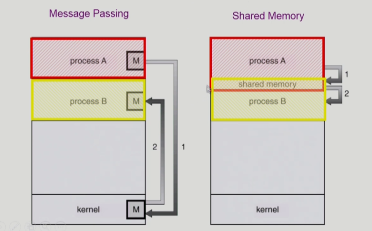
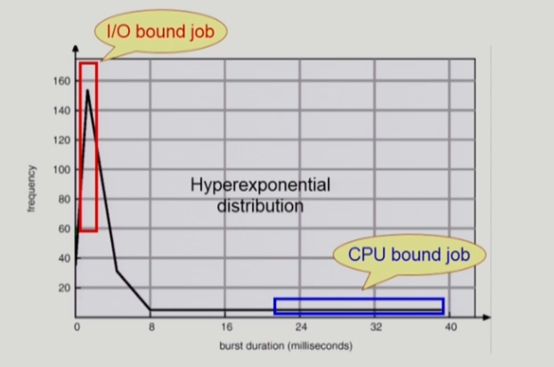

## [프로세스 관리 #1](https://core.ewha.ac.kr/publicview/C0101020140321144554159683?vmode=f)

### 프로세스 생성 (Process Creation)

- 부모 프로세스가 자식 프로세스를 생성
  - 하나의 부모가 여러 자식을 생성 가능 - 트리 구조 형성
  - 프로세스는 자원을 필요로 한다.
    - 그 자원은 보통 운영체제로부터 받는다
    - 부모와 공유한다.
  - 자원의 공유
    - 부모자식이 모든자원 공유
    - 일부공유
    - 전혀공유X ( 보통의 경우 ) 
  - 수행
    - 부모/자식은 공존하며 수행되는 모델
    - 자식이 종료될 때까지 부모가 기다리는 모델
- 주소 공간(Address space)
  - 자식은 부모의 공간을 복사함
  - 자식은 그 공간에 새로운 프로그램을 올린다.
  - ex) UNIX
    - fork() 시스템 콜이 새로운 프로세스를 생성
      - 부모를 그대로 복사 (OS data except PID + binary)
      - 주소 공간 할당
    - fork() 담에 이어지는 exec() 시스템 콜을 통해 새로운 프로그램 메모리에 덮어씌움

### 프로세스 종료 (Process Termination)

- 프로세스가 마지막 명령을 수행한 후 운영체제에게 이를 알려준다
  - exit 시스템 콜
  - 자식이 부모에게 output data 를 보낸다 (via wait).
  - 프로세스의 각종 자원들이 운영체제에게 반납된다.
- 부모 프로세스가 자식의 수행을 종료시킴(abort)
  - 자식이 할당 자원의 한계치를 넘어섬
  - 자식에게 할당된 태스크가 더 이상 필요하지 않음
  - 부모가 종료하는 경우
    - 운영체제는 부모 프로세스가 종료하는 경우 더 이상 자식이 수행되도록 두지 않음
    - 단계적인 종료 맨 밑의 레이어부터 종료된 후 상위 객체를 종료시킴

## [프로세스 관리 #2](https://core.ewha.ac.kr/publicview/C0101020140325134428879622?vmode=f) , Process Management

### 프로세스와 관련한 시스템콜

- fork() : 새로운 프로세스를 생성하는 시스템 콜
  - 자식프로세스는 포크를 생성한 시점부터 시작한다(처음부터 시작하지 않음)
    - 부모의 컨텍스트와 시스템 인카운터를 따라가기 때문ㅇ
  - pid값은 자식의 경우 fork()값이 0을 반환, 부모의 경우 0 초과값을 반환
- exec() : 프로그램을 완전히 새로운 프로세스로 만드는 시스템 콜
  - execlp() : exec시스템 콜을 부르는 함수, 실행시 함수 내에 인자로 전달된 새로운 기능이 실행
  - 되돌아올 수 없으며, exec시스템 콜을 실행하여 해당 함수 완료 시 프로세스가 종료된다.
- wait() : 커널은 child가 종료될 때까지 프로세스를 sleep상태로 만든다(block된 상태)
  - Child process가 종료되면 커널은 프로세스를 다시 실행시킨다(ready상태)
- exit() : 프로세스의 종료
  - 자발적 종료
    - 마지막 statement수행 후 exit시스템 콜을 통해 호출
    - 프로그램에 명시적으로 적어주지 않아도 main함수 리턴위치에 컴파일러가 넣어줌
  - 비자발적 종료
    - 부모 프로세스가 자식 프로세스를 강제 종료
      - 자식 프로세스가 한계치를 넘어서는 자원 요청
      - 자식에게 할당된 태스크가 더 이상 필요X
    - 키보드로 kill / break 등을 입력한 경우
    - 부모가 종료하는 경우 / 맨 밑 자식부터 순차적으로 종료됨

### 프로세스 간 협력

- 독립적 프로세스	
  - 프로세스는 각자의 주소 공간을 가지고 수행되므로 원칙적으로 하나의 프로세스는 다른 프로세스의 수행에 영향을 미치지 못한다.
  - 협력 프로세스
    - 프로세스 협력 메커니즘을 통해 하나의 프로세스가 다른 프로세스의 수행에 영향을 미칠 수 있따.
  - 프로세스 간의 협력 메커니즘(IPC)
    - 메세지를 전달하는 방법
      - 커널을 통해 메세지를 전달한다.
    - 주소 공간을 공유하는 방법
      - shared memory(공유 메모리) : 서로 다른 프로세스 간에도 일부 주소 공간을 공유하게 하는 shared memory 메커니즘이 있다.
      - thread :  쓰레드는 하나의 프로세스이므로 프로세스 간 협력으로 보기는 어려우나 동일한 process를 구성하는 thread들 간에는 주소공간을 공유하므로 협력이 가능하다.

### Message Passing

- Message System
  - 프로세스 사이에 공유 변수를 일체 사용하지 않고 통신하는 시스템
  - Direct Community
    - 통신하려는 프로세스의 이름을 명시적으로 표시한다.
  - Indirect Communication
    - mailbox (or port)를 통해 메세지를 간접적으로 전달한다
    - mailbox를 매개체로 이용하는 모습

### Interprocess communication

- shared 메모리를 사용하려면 system call을 kernel에 주어서 shared memory를 구현하여야 한다.

### CPU and I/O Bursts in Program Execution

- CPU burst와 I/O burst를 반복하여 실행
- 프로그램의 종류에 따라서 빈도/길이의 차이가 존재한다.

### CPU-burst Time의 분포

- 
- CPU scheduling이 필요하다.
- = 시스템 자원을 골고루 효율적으로 사용하기 위해서

### 프로세스의 특성 분류

- I/O bound process
  - CPU를 잡고 계산하는 시간보다 I/O 에 많은 시간이 필요한 작업
  - many short CPU bursts
- CPU-bound process
  - 계산 위주의 job
  - few very long CPU bursts

### CPU Scheduler & Dispatcher

- CPU Scheduler
  - Ready 상태의 프로세스 중에서 이번에 CPU를 할당할 프로세스를 선정
- Dispatcher
  - CPU의 제어권을 스케쥴러에 의해 선택된 프로세스에 넘긴다.
  - 이 과정을 context switch라고 부른다.
- CPU 스케쥴링이 필요한 경우는 프로세스에게 다음과 같은 상태 변화가 있는 경우
  - Running - blocked I/O 요청 시스템 콜
  - running - ready 할당시간 만료로 timer interrupt
  - blocked - ready I/O 완료 후 인터럽트
  - terminate
  - 1,4의 스케쥴링은 nonpreemptive(자진 반납하도록 유도)
  - 2,3의 스케쥴링은 preemptive(강제로 빼앗는다.)