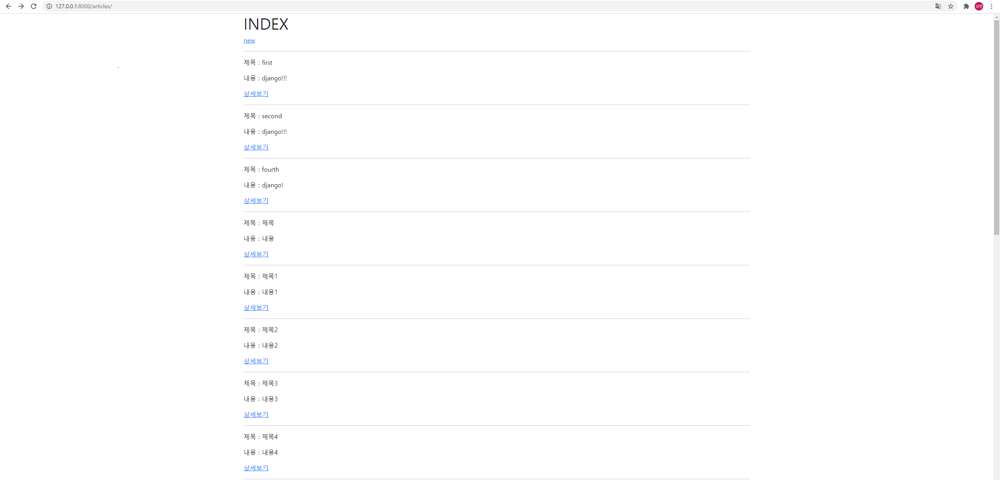
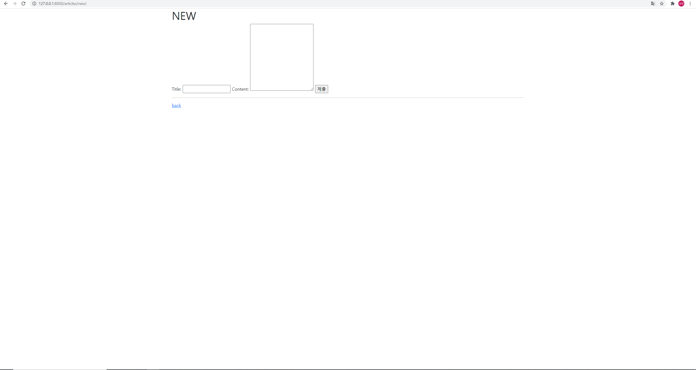
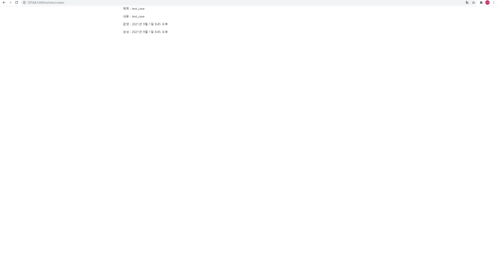

# Workshop Problem_0901

1-1 index-html문서




  <h1>INDEX</h1>

  <a href="">new</a>
  <hr>
  
    <p>제목 : {{ article.title}} </p>
    <p>내용 : {{ article.content }} </p>
    <a href="">상세보기</a>
    <hr>
  



index-views.py 문서

def index(request):
    # 작성된 모든 게시글 출력

    articles = Article.objects.all()
    context = {
        'articles': articles
    }
    return render(request, 'articles/index.html', context)


```python
1-2
new.html문서




  <h1>NEW</h1>
  <form action="" method="POST">
    
    <label for="title">Title: </label>
    <input type="text" id="title" name="title">
    <label for="content">Content: </label>
    <textarea name="content" id="content" cols="30" rows="10"></textarea>
    <input type="submit">
  </form>
  <hr>
  <a href="">back</a>



```


```python
1-3
views.py의 create함수

def create(request):
    #new로부터 title과 content를 받아서 저장
    title = request.POST.get('title')
    content = request.POST.get('content')

    article = Article(title = title, content = content)
    article.save()
    
    pk = article.pk

    article = Article.objects.get(pk=pk)
    context = {
        'article': article
    }

    #article = Article()
    #return redirect('articles:detail', article.pk)
    return render(request, 'articles/create.html', context)


views.py의 detail함수

def detail(request, pk):
    #all(), get(), filter()
    article = Article.objects.get(pk=pk) #(keyword = 실제pk값)
    context ={
        'article': article,
    }
    return render(request, 'articles/detail.html', context)
    pass
```







