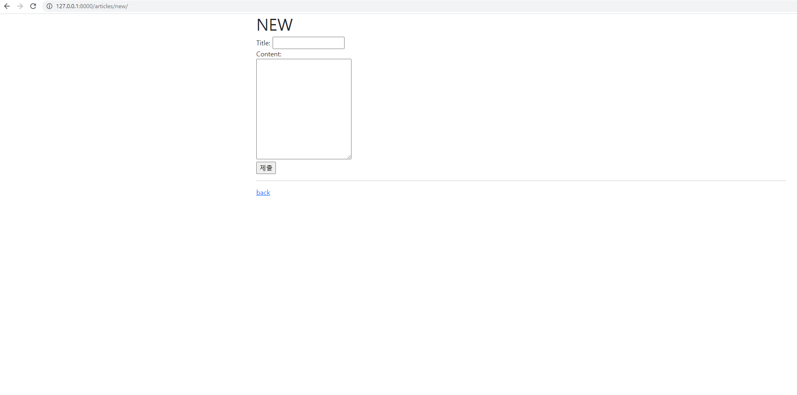
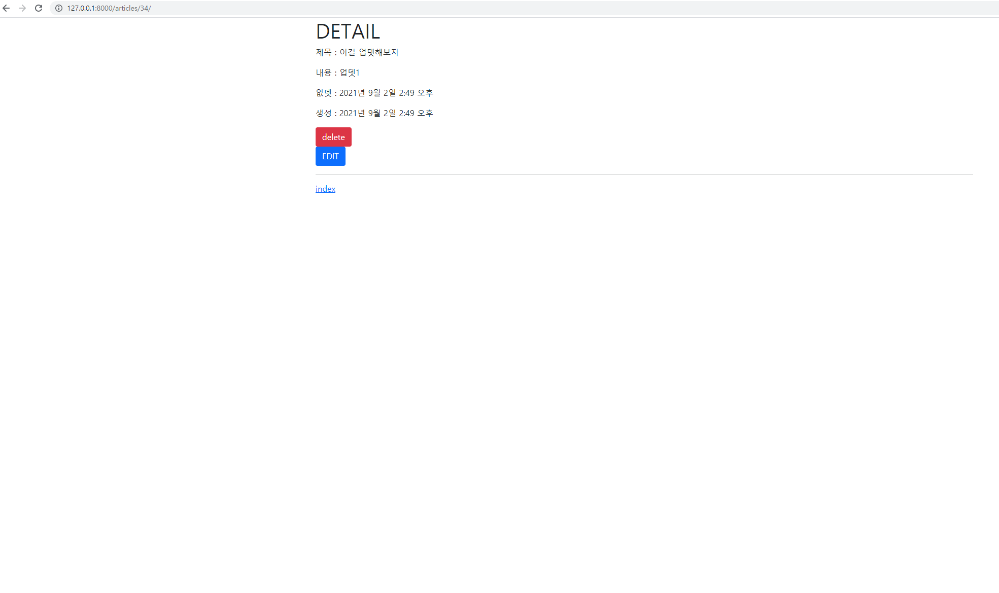
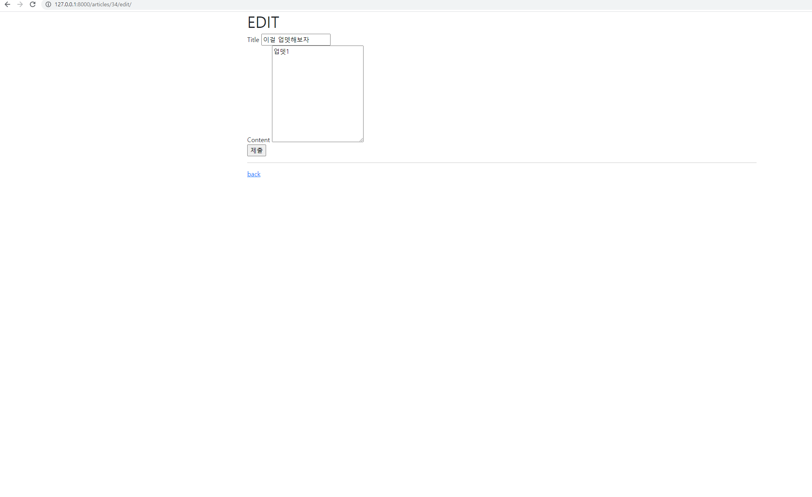

# Workshop Problem_0902


```python
1. Views.py

from django.shortcuts import redirect, render
from .models import Article
# Create your views here.
def index(request):
    # 작성된 모든 게시글 출력

    articles = Article.objects.all() #QuerySet
    context = {
        'articles': articles
    }
    return render(request, 'articles/index.html', context)

def new(request):
    return render(request, 'articles/new.html')


def create(request):
    #new로부터 title과 content를 받아서 저장
    title = request.POST.get('title')
    content = request.POST.get('content')

    article = Article(title = title, content = content)
    article.save()
        
    context = {
        'article': article
    }

    return render(request, 'articles/create.html', context)


def detail(request, pk):
    #all(), get(), filter()
    article = Article.objects.get(pk=pk) #(keyword = 실제pk값)
    context ={
        'article': article,
    }
    return render(request, 'articles/detail.html', context)
    pass


def delete(request, pk):
    
    article = Article.objects.get(pk=pk)
    if request.method == 'POST':
        article.delete()
        return redirect('articles:index')
    else:
        return redirect('articles:index', article.pk)
    


def edit(request, pk):

    article = Article.objects.get(pk=pk)
    context = {
        'article': article,
    }
    return render(request, 'articles/edit.html', context)


def update(request, pk):
    article = Article.objects.get(pk=pk)
    article.title = request.POST.get('title')
    article.content = request.POST.get('content')
    article.save()

    return redirect('articles:detail', article.pk)
```


```python
2-1 create.html




    <p>제목 : {{ article.title}} </p>
    <p>내용 : {{ article.content }} </p>
    <p>없뎃 : {{ article.updated_at }} </p>
    <p>생성 : {{ article.created_at }} </p>

    <a href="">돌아가기</a>
    <form action="" method="POST">
      
      <button class="btn btn-danger"> delete</button>
    </form>


```


```python
2-2 detail.html




  <h1>DETAIL</h1>
    <p>제목 : {{ article.title}} </p>
    <p>내용 : {{ article.content }} </p>
    <p>없뎃 : {{ article.updated_at }} </p>
    <p>생성 : {{ article.created_at }} </p>

    <form action="" method="POST">
      
      <button class="btn btn-danger"> delete</button>
    </form>

    <a href="" class="btn btn-primary">EDIT<a>

    <hr>
    <a href="">index</a>
    

```


```python
2-3 edit.html




  <h1>EDIT</h1>

  <form action="" method="POST">
    
    <label for "title"> Title </label>
    <input type="text" name="title" value="{{article.title}}"><br>
    <label for "content"> Content </label>
    <textarea name="content" cols="30" rows="10">{{ article.content }}</textarea><br>
    <input type="submit">
  </form>
    
  <hr>
  <a href="">back</a>


```


```python
2-4 index.html




  <h1>INDEX</h1>

  <a href="" class="btn btn-primary">새글작성</a>
  <hr>
  
    <p>제목 : {{ article.title}} </p>
    <p>내용 : {{ article.content }} </p>
    <a href="">상세보기</a>
    <hr>
  


```


```python
2-5 new.html




  <h1>NEW</h1>
  <form action="" method="POST">
    
    <label for="title">Title: </label>
    <input type="text" id="title" name="title">
    <br>
    <label for="content">Content: </label>
    <br>
    <textarea name="content" id="content" cols="30" rows="10"></textarea>
    <br>
    <input type="submit">
  </form>
  <hr>
  <a href="">back</a>

```


```python

```






