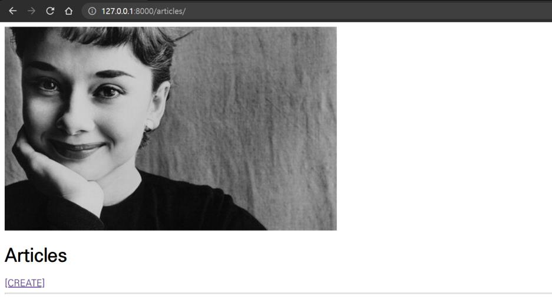

# Workshop problem_0908 

1. index페이지에서 메인 이미지가 출력되지 않을 때 
   1. -settings.py 내의 설정에 STATICFILES_DIRS = [ BASE_DIR / 'static'] 을 추가한다.

2. 이미지가 추가되지 않을 떄

   1.  create.html에서 form태그에 enctype="multipart/form-data"를 추가한다.

   2.  프로젝트의 urls.py에 

      from django.conf import settings

      from django.conf.urls.static import static

      두 개의 모듈을 import하고 urlpatterns에

      static(settings.MEDIA_URL, document_root=settings.MEDIA_ROOT)

      를 추가한다.

      

