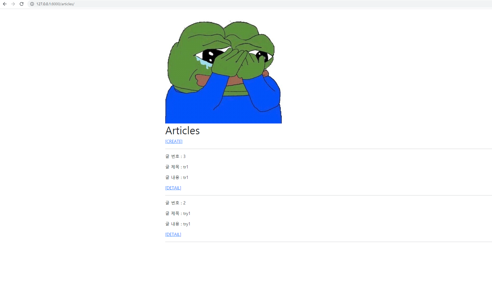
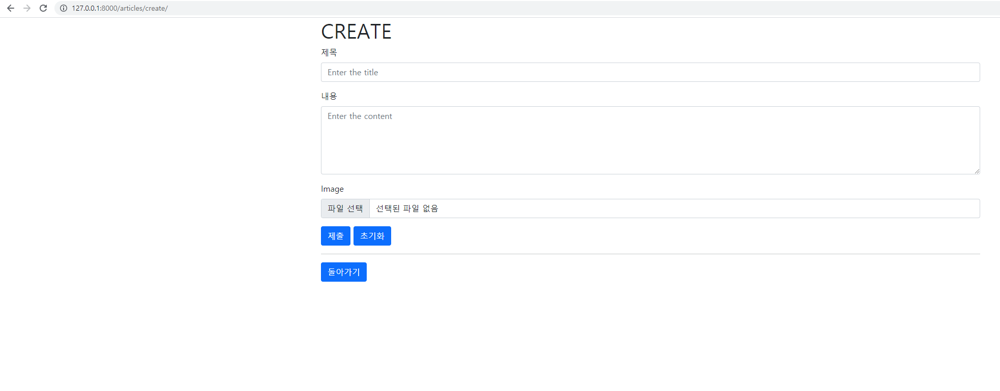
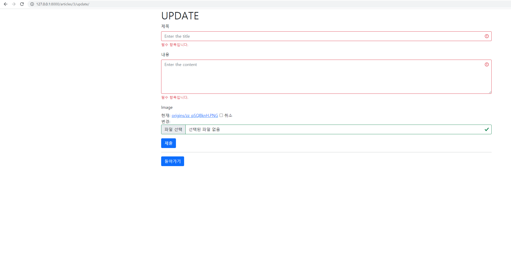
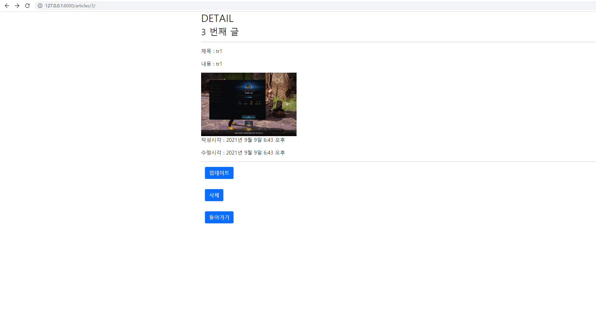

# Workshop problem_0909


## 1. index.html



```html



  
  <h1>Articles</h1>
  <a href="">[CREATE]</a>
  <hr>
  
    <p>글 번호 : {{ article.pk }}</p>
    <p>글 제목 : {{ article.title }}</p>
    <p>글 내용 : {{ article.content }}</p>
    <a href="">[DETAIL]</a>
    <hr>
  

```


## 2. Create.html



```html




  <h1>CREATE</h1>
  <form action="" method="POST" enctype="multipart/form-data">
    
    
    
  </form>
  <hr>
  <form action="">
    
    
  </form>

```

## 3. Update.html



``` html




  <h1>UPDATE</h1>
  <form action="" method="POST" enctype="multipart/form-data">
    
    
    
  </form>
  <hr>
  <form action="">
    
    
  </form>


```


## 4. detail.html



``` html






  <h2>DETAIL</h2>
  <h3>{{ article.pk }} 번째 글</h3>
  
  <hr>
  <p>제목 : {{ article.title }}</p>
  <p>내용 : {{ article.content }}</p>

  
    
  
    
  
  <p>작성시각 : {{ article.created_at }}</p>
  <p>수정시각 : {{ article.updated_at }}</p>
  <hr>
  <div class='container'>
    <div class="row g-3">
      <form action="" method="POST">
        
        
      </form>

      <form action="" method="POST">
        
        
      </form>

      <form action="">
        
        
      </form>
    </div>
  </div>
```

