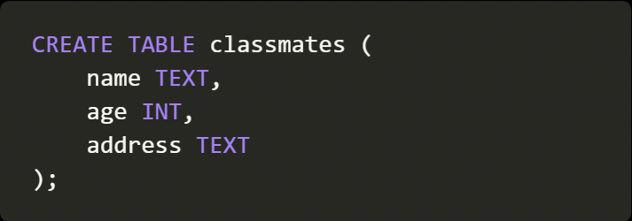

# Homework Problem_0914


## 1.SQL 용어 및 개념 - 아래의 보기에서 각 문항의 설명에 맞는 용어를 고르시오.

* ### 보기 : 기본키, 테이블, 스키마, 레코드, 컬럼

1) 관계형 데이터베이스에서 구조와 제약조건에 관련한 전반적인 명세를 기술 한 것 - 스키마
2) 열과 행의 모델을 사용해 조직된 데이터 요소들의 집합 - 테이블
3) 고유한 데이터 형식이 지정되는 열 - 컬럼 
4) 단일 구조 데이터 항목을 가리키는 행 - 레코드
5) 각 행의 고유값 - 기본키


## 2. SQL 문법

* CREATE : DDL
* UPDATE: DML
* DELETE : DML
* SELECT : DML

#### DML이 아닌 문법은 CREATE


 ## 3. Relational DBMS

- #### RDBMS의 개념적 정의 / 이를 기반으로 한 DB-ENGINE의 종류 3가지 이상


#### RDBMS(Relational DataBase Management System)은 관계형 모델을 기반으로 하는 데이터베이스 관리시스템을 의미한다.

#### Examples

* MySQL
* SQLITE
* PostgreSQL
* ORACLE


## 4. INSERT INTO

* 다음과 같은 스키마를 가지는 테이블이 있을 떄, 다음 중 틀린 문장은?



```sqlite
(1) INSERT INTO classmates (name, age, address) 
	VALUES(‘홍길동’, 20, ‘seoul’); 

(2) INSERT INTO classmates VALUES(‘홍길동’, 20, ‘seoul’);

(3) insert into classmates 
	values(address=‘seoul’, age=20, name=‘홍길동’); -- Error: no such column: address

(4) insert into classmates (address, age, name) 
	values(‘seoul’, 20, ‘홍길동’);
```


## 5. 와일드카드 문자

* #### SQL에서 사용가능한 와일드카드 문자인 %와 _를 비교하여 작성


#### %는 해당 문자열이 여러 글자이거나, 아예 문자열이 없는 공백이여도 상관없지만,  '_'를 와일드카드로 작성할 경우 반드시 해당 자리에 단 한 개의 문자열이 자리해야 한다.

#### example

* 1_ _ _ : 1을 처음 숫자로 하는 정확히 4자리 문자열
* 1% : 1을 처음 숫자로 하는 어떤 문자열