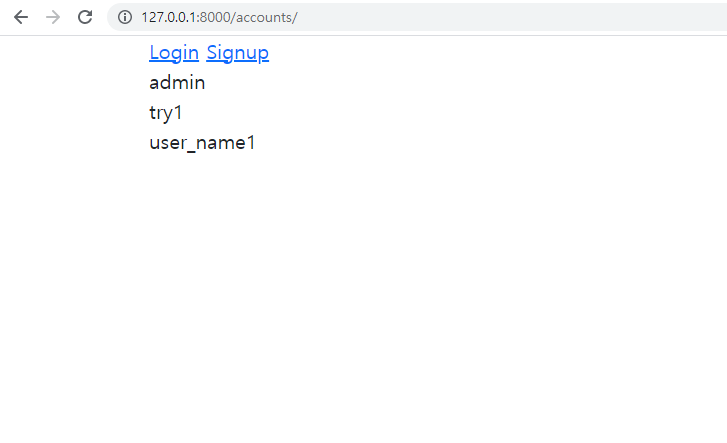
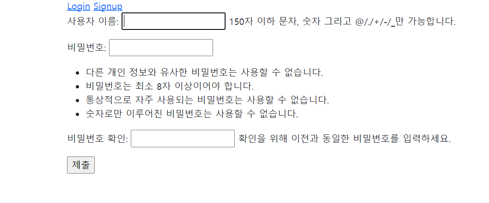

Workshop Problem_0915


## 1. /accounts/

#### 유저 목록을 출력하는 페이지를 나타낸다.


```python 
#views.py

from django.contrib.auth.models import User

def accounts(request):
    users = User.objects.order_by('pk')

    context = {
        'users': users
    }
    return render(request, 'accounts/accounts.html', context)
```

```html
#accounts.html





  
    <br>{{user}}
  

```





## 2. /accounts/signup/

#### 회원가입 작성을 위한 페이지를 나타낸다.

```python
# views.py

from django.contrib.auth.forms import UserCreationForm
def signup(request):
    if request.method == 'POST':
        form = UserCreationForm(request.POST)
        if form.is_valid():
            user = form.save()
            auth_login(request, user) #회원가입 후 로그인까지 진행
            return redirect('articles:index')
    else:
        form = UserCreationForm()
    context = {
        'form': form,
    }
    return render(request, 'accounts/signup.html', context)

```



