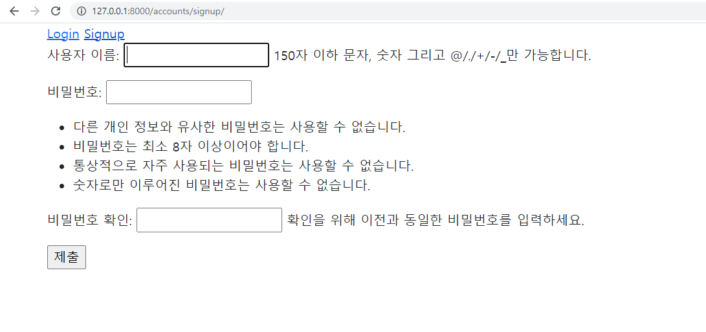
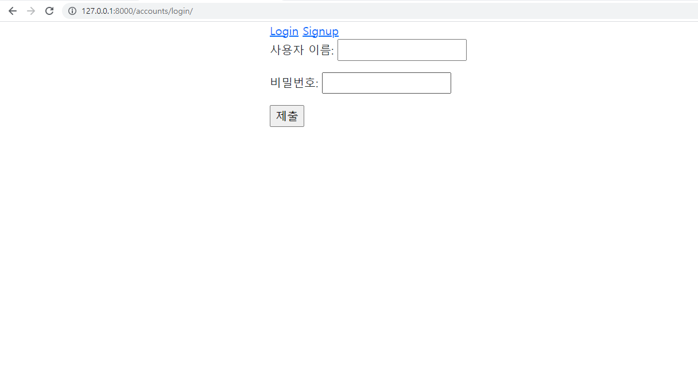
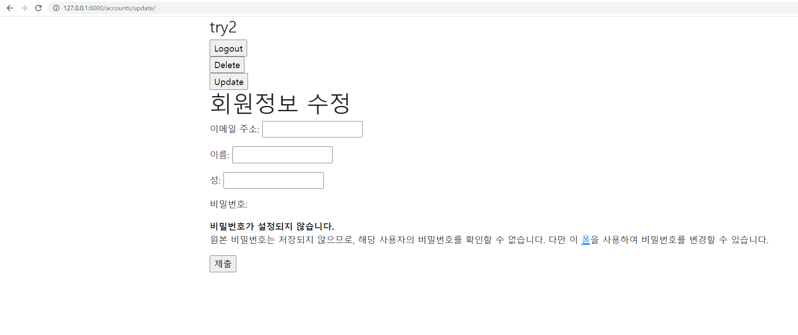

Practice Problem_0916


## 1. User Create

```python
def signup(request):
    if request.method == 'POST':
        form = UserCreationForm(request.POST)
        if form.is_valid():
            user = form.save()
            auth_login(request, user) #회원가입 후 로그인까지 진행
            return redirect('articles:index')
    else:
        form = UserCreationForm()
    context = {
        'form': form,
    }
    return render(request, 'accounts/signup.html', context)
```




## 2. User Login

```python
def login(request):
    if request.user.is_authenticated:
        return redirect('articles:index')

    if request.method == 'POST':
        form = AuthenticationForm(request, request.POST)
        if form.is_valid():
            auth_login(request, form.get_user())
            return redirect('articles:index')
    else:
        form = AuthenticationForm()
    context = {
        'form': form
    }
    return render(request, 'accounts/login.html', context)
```



## 3. User Logout

``` python
@require_POST
def logout(request):
    if request.user.is_authenticated:
        auth_logout(request)
    return redirect('articles:index')
```


## 4. User Update

```python
@login_required
@require_http_methods(['GET', 'POST'])
def update(request):
    if request.method == 'GET':
        form = CustomUserChangeForm(request.POST, instance=request.user)
        if form.is_valid():
            form.save()
            return redirect('articles:index')
    else:
        form = CustomUserChangeForm(instance=request.user)
    context = {
        'form': form,
    }
    return render(request, 'accounts/update.html', context)
```




## 5. User Delete

``` python
@require_POST
def delete(request):
    if request.user.is_authenticated:
        request.user.delete()
        auth_logout(request)
    return redirect('articles:index')
```

