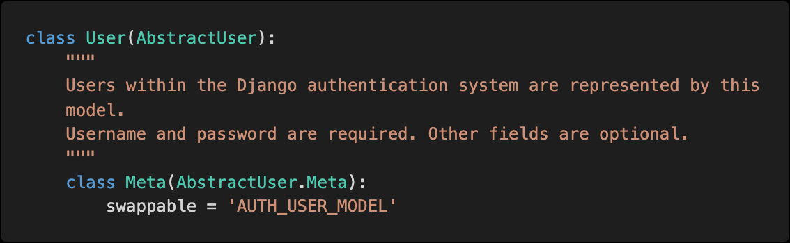
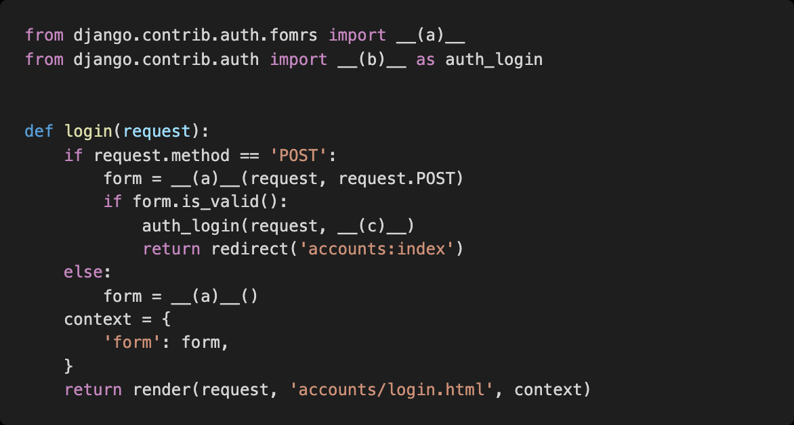
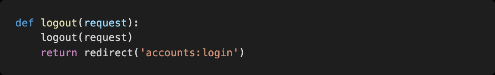

# Homework Problem_0916


## 1. User Model BooleanField

django에서 기본적으로 사용하는 User모델은 AbstractUser모델을 상속받아 정의된다.



* 아래의 models.py를 참고하여 User모델에서 사용할 수 있는 칼럼들 중 Booleanfield로 정의된 컬럼을 모두 작성

```python
is_staff = models.BooleanField(
    _('staff status'),
    default=False,
    help_text=_('Designates whether the user can log into this admin site.'),
)
is_active = models.BooleanField(
    _('active'),
    default=True,
    help_text=_(
        'Designates whether this user should be treated as active. '
        'Unselect this instead of deleting accounts.'
    ),
)
```


## 2. Username Max Length

django에서 기본적으로 사용하는 User모델의 username 컬럼이 저장할 수 있는 최대 길이는?

* 아래에서 username의 max_length=150이므로 150자

```python
class AbstractUser(AbstractBaseUser, PermissionsMixin):
    """
    An abstract base class implementing a fully featured User model with
    admin-compliant permissions.
    Username and password are required. Other fields are optional.
    """
    username_validator = UnicodeUsernameValidator()

    username = models.CharField(
        _('username'),
        max_length=150,
        unique=True,
        help_text=_('Required. 150 characters or fewer. Letters, digits and @/./+/-/_ only.'),
        validators=[username_validator],
        error_messages={
            'unique': _("A user with that username already exists."),
        },
    )
    first_name = models.CharField(_('first name'), max_length=150, blank=True)
    last_name = models.CharField(_('last name'), max_length=150, blank=True)
    email = models.EmailField(_('email address'), blank=True)
    is_staff = models.BooleanField(
        _('staff status'),
        default=False,
        help_text=_('Designates whether the user can log into this admin site.'),
    )
    is_active = models.BooleanField(
        _('active'),
        default=True,
        help_text=_(
            'Designates whether this user should be treated as active. '
            'Unselect this instead of deleting accounts.'
        ),
    )
    date_joined = models.DateTimeField(_('date joined'), default=timezone.now)

    objects = UserManager()

    EMAIL_FIELD = 'email'
    USERNAME_FIELD = 'username'
    REQUIRED_FIELDS = ['email']

    class Meta:
        verbose_name = _('user')
        verbose_name_plural = _('users')
        abstract = True
```


## 3. Login Validation

단순히 사용자가 ‘로그인 된 사용자인지’만을 확인하기 위하여User 모델 내부에 정의된 속성의 이름

* is.authenticated

* ```python
  def login(request):
      if request.user.is_authenticated:
          return redirect('articles:index')
  #로그인된 사용자면 articles:index로 보낸다.
  ```

  

## 4. Login 기능 구현



(a) : AuthenticationForm

(b) : login

(c) : request.POST

<hr>

## 5. Who Are You?

로그인을 하지 않았을 경우 template에서 user 변수를 출력했을 때 나오는 클래스의 이름을 작성하시오

* AnonymousUser


## 6. 암호와 알고리즘

Django에서 기본적으로 User 객체의 password 저장에 사용하는 알고리즘과 함께 사용된 해시 함수를 작성하시오


## 7. Logout 기능 구현



위와 같이 작성할 경우 1. method를 POST로 지정하여 예외 상황을 차단해야 하며, 2. 로그인되지 않은 사용자에 대해서도 로그아웃이 될 수 있기 때문에  다음과 같이 작성하면 된다.

```python
def logout(request):
    if request.user.is_authenticated:
        auth_logout(request)
    return redirect('articles:index')
```

